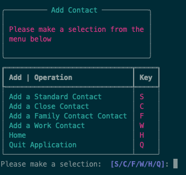

# **Coder Academy - Assignment T1A3 - Terminal Application: Submitted by Mario Lisbona**

## **Table of contents**

[**Coder Academy - Assignment T1A3 - Terminal Application: Submitted by Mario Lisbona**](#coder-academy---assignment-t1a3---terminal-application-submitted-by-mario-lisbona)
[**Table of contents**](#table-of-contents)
- [**Coder Academy - Assignment T1A3 - Terminal Application: Submitted by Mario Lisbona**](#coder-academy---assignment-t1a3---terminal-application-submitted-by-mario-lisbona)
  - [**Table of contents**](#table-of-contents)
  - [**R4 - Links**](#r4---links)
  - [**R5 - Styling Conventions**](#r5---styling-conventions)
  - [**R6 - Features**](#r6---features)
    - [**Feature 1 - Create / Add a contact**](#feature-1---create--add-a-contact)
    - [**Feature 2 - Edit a contact**](#feature-2---edit-a-contact)
    - [**Feature 3 - Delete a contact**](#feature-3---delete-a-contact)
    - [**Feature 4 - Display contacts**](#feature-4---display-contacts)
      - [**Display a contact**](#display-a-contact)
      - [**Display all contacts**](#display-all-contacts)
    - [**Feature 5 - Creating a new Contact Book or Accessing an existing one**](#feature-5---creating-a-new-contact-book-or-accessing-an-existing-one)
    - [**Feature 6 - Match cases for main program menu and Add Contact Menu**](#feature-6---match-cases-for-main-program-menu-and-add-contact-menu)
    - [**Feature 7 - Navigation Menus**](#feature-7---navigation-menus)
      - [**Contact Book selection menu**](#contact-book-selection-menu)
      - [**Home menu**](#home-menu)
      - [**Add Contact menu**](#add-contact-menu)
    - [**Feature 8 - Classes**](#feature-8---classes)
  - [**R7 - Implementation Plan**](#r7---implementation-plan)
    - [**Feature 1 - Create / Add a contact**](#feature-1---create--add-a-contact-1)
    - [**Feature 2 - Edit a contact**](#feature-2---edit-a-contact-1)
    - [**Feature 3 - Delete a contact**](#feature-3---delete-a-contact-1)
    - [**Feature 4 - Display contacts**](#feature-4---display-contacts-1)
    - [**Feature 5 - Creating a new Contact Book or Accessing an existing one**](#feature-5---creating-a-new-contact-book-or-accessing-an-existing-one-1)
    - [**Feature 6 - Match cases for main program menu and Add Contact Menu**](#feature-6---match-cases-for-main-program-menu-and-add-contact-menu-1)
    - [**Feature 7 - Menus**](#feature-7---menus)
    - [**Feature 8 - Create Classes**](#feature-8---create-classes)
    - [**Prioritisation**](#prioritisation)
    - [**Time line and Due dates**](#time-line-and-due-dates)
  - [**R8 - Help Documentation**](#r8---help-documentation)
  - [**Attributions**](#attributions)

## **R4 - Links**

- [Github Repo]()
- [Slide Deck Presentation link - Youtube]()

## **R5 - Styling Conventions**

 - style guide: PEP8 style guide

## **R6 - Features**

### **Feature 1 - Create / Add a contact**

The Contacts Book will need to be able to add a contact. The user will be able to select between 4 types of contacts to add to their contact book.
- Contact
- Close Contact
- Family Contact
- Work Contact

The contacts will share some commonalities with their input fields. All contacts will contain the base fields of first name, last name and phone number. Below is a list of the input fields for each contact type and the fields they share. I will use classes and classes to implement this functionality and inheritance. All contact variables will be of String Type.

| Contact      | Close Contact                          | Family Contact                               | Work Contact                                 |
|--------------|----------------------------------------|----------------------------------------------|----------------------------------------------|
| ID           | ID                                     | ID                                           | ID                                           |
| Contact Type | Contact Type                           | Contact Type                                 | Contact Type                                 |
| First name   | First name  (inherited from Contact)   | First name  (inherited from Close Contact)   | First name  (inherited from Close Contact)   |
| Last name    | Last name  (inherited from Contact)    | Last name  (inherited from Close Contact)    | Last name  (inherited from Close Contact)    |
| Phone number | Phone number  (inherited from Contact) | Phone number  (inherited from Close Contact) | Phone number  (inherited from Close Contact) |
|              | Address                                | Address  (inherited from Close Contact)      | Address  (inherited from Close Contact)      |
|              |                                        | Pet name                                     | Work Address                                 |
|              |                                        | Favourite Drink                              | Work Phone                                   |
|              |                                        |                                              | Skills                                       |

<br>


<br>

Variables will be assigned depending on which type of contact is being created. Once this has been done, those variables will become key/pair values in a dictionary. That dictionary will be inserted into json file with a unique ID

The TinyDB module will be used to manage the database CRUD, Create, Read, Update and Delete functions. Every time a contact is created the user ID will need to be incremented. Deeper Error checking will need to be performed on 3 of the fields:
- first name
  - remove leading or trailing white spaces
  - prompt user to enter valid data if the field is completly empty
  - prompt user to enter valid data if the field is made up of only white space
- last name
  - remove leading or trailing white spaces
  - prompt user to enter valid data if the field is completly empty
  - prompt user to enter valid data if the field is made up of only white space
- phone number
  - remove leading or trailing white spaces
  - have the data be only numeric
  - allow white space inbetween numbers
- work phone number
  - remove leading or trailing white spaces
  - have the data be only numeric
  - allow white space inbetween numbers

  
### **Feature 2 - Edit a contact**

The user will be able to edit an existing contact. They will be able to search the contacts book for a first name. The application will then use TinDB’s search and get methods to retrieve the contact if it exists in the database. If there is only a single contact with that name, the contact will be displayed and the user will be prompted to confirm whether they want to edit that contact. If they select no is selected then they are taken back to the Home Menu. If they confirm that they want to edit the contact then they will be asked to fill in the particular fields that are valid for that contact type.

If multiple results return from the name search then all the contacts with their unique ID will be displayed in a table. The user will be prompted to choose an ID to edit. Error checking here will be vital so that they don't edit a different contact to the ones that are displayed.

Once a valid ID has been selected, the user will be asked to confirm they want to edit this contact. If they choose no, they’ll be returned to the home menu, otherwise they will be asked to fill in the particular fields that are valid for that contact type. 

Each contact dict will have a key/value pair of ```type: contact_type```. The edit feature will access this type from the selected contact to edit and use it in a match case structure so that the correct type of contact input fields are called for the type of contact that has been returned by the search.

If no results are found, display a message to the user and prompt them to search for another user or go back to the home menu.

The edit feature will use the same code as the create contact, so will utilise the same error checking functionality.


  
### **Feature 3 - Delete a contact**

The delete feature will be similar to the edit feature in that it will search the database for a name entered by the user. A message will be displayed if the name cannot be found and they’ll be prompted to search again or be taken back to the home menu. Results, singular and multiple will be displayed to the user. They will need to select and ID to delete with multiple results.
Once a contact has been selected then they are prompted to confirm the delete. If they select yes the contact will be deleted and returned to the home menu.


### **Feature 4 - Display contacts**

This feature will be implemented in two ways, searching for a contact to be displayed and displaying the entire contact book.

#### **Display a contact**

The user will search for a contact. The same search functionality that is shared with the edit and delete features will be used. Multiple and single results will be displayed in a table. The user will be prompted to search again or return home. If a result is not found, the user will be prompted to search again or be returned to the home menu.

#### **Display all contacts**

The whole database will be displayed in a table if the user selects this option. The table is created using the Rich module. First the table is created and headings assigned to columns. Then a for loop is used to iterate over the database and create a new row for each contact. If statements are used to access the right amount of elements for each contact type

### **Feature 5 - Creating a new Contact Book or Accessing an existing one**

The application will start on a menu prompting the user to make a choice between creating a new contacts book or creating a new one. They can also quit the application at this stage as well.

I am including this feature because I wanted the user (Educator) to have some mock data to play around with rather than having to enter information to test the features.

If the user wants to access an existing contacts book then firstly an instance of the TinyDB class will need to be created along with the path to the contacts.json file. Once this is done, we can assign the contents of the json file to a variable. We need to find the next available ID so that we aren't creating ID’s that clash with the existing contacts. This will be done by accessing TinyDB’s .doc_id method. This will return the ID that is assigned to each document (contact) in the json file. The application will need to iterate over the entire json file to find the last ID that is used. This will be incremented by 1 and used for the next contact that is created.

If the user chooses to create a new database then the user ID will need to be initialised to zero and then the new database will be iterated over.

### **Feature 6 - Match cases for main program menu and Add Contact Menu**

A match case, combined with while loops will be used for the home menu and the add contact menu so that the application will run continually until the user chooses to quit.

There will also be another match cased used by the application only (not accessible by the user) that will facilitate the editing of contacts. It will access use the documens returned by the search of the json file. The ```type: contact_type``` of that document will be accessed and a match case will be used to determin which type of contact needs to be edited.

### **Feature 7 - Navigation Menus**

The application will feature menu’s to allow the user to navigate through the different functionality of the app. The user will be able to create, update, delete or display contacts indefinitely until they decide to quit the application. All the error checking of user input for the menu options is handled by the Rich module. There will be 3 main menus for the user to naviate the application:
- Contact Book selection menu
- Home menu
- Add Contact menu

#### **Contact Book selection menu**

This menu will be the first menu that the user is presented with. They will be able to choose to open a new contacts book, open an existing book or quit the application.

<br>


<br>

#### **Home menu**

The Home menu will allow the user to select they functionality that they want to use, Add, edit, delete, display or quit the application

<br>


<br>

#### **Add Contact menu**

This menu will be displayed when the user selects the Add Contact option from the home menu. The user will be able to add any type of contact, return to the home menu or quit the application. Once a contact has been added the user will continually be returned to the add contact menu untill they decide to return home or quit the application.

<br>



<br>

There will also be various menu's prompting users to confirm an edit or a delete or whether they want to perform another search.

<br>


<br>

<br>


<br>


### **Feature 8 - Classes**

Each contact type will have its own class object. The base class will be Contact and will contain a class menthod to get the details from the user for first name, last name and phone number. The close Contact class will be derived from the Contact class so will inherit the user inputs for first name, last name and phone number. It will have an extra field for address. The Family Contact class will be derived from the Contact class and will inherit from its parent, Close Contact. It will had two extra attributes for pet name and favourite drinks. Lastly, the Work Contact class will be derived from the Close Contact class as well. It will had its own attributes of work address, work phone and skills.

## **R7 - Implementation Plan**

Below is a description of how each feature will be implemented. Below that are the prioritisation and timeline tables showing how I will structure the time available for the project

Please use the following link to my Trello Kanban board. You will need to be a member of this board to access the cards linked below in each feature.

*Become a membor of my Trello Kanban Board* -  [T1A3 - Terminal Application](https://trello.com/invite/b/saDZZxHD/5d41a86ce59bd13dba73c716b2d86d00/t1a3-terminal-application)

### **Feature 1 - Create / Add a contact**

Firstly I will need to ask the user what type of contact they want to create and use a match case to direct the program flow to create the correct type of contact. Once the contact type has been established, the `set_details()` method will be called from either the contact, close contact, family contact or work contact class, which will return the user input back into the match case in variables. 

These variables, along with a user ID, will be passed as arguments to the `add_contact()` function which will return the correct size dictionary to a variable in the match case. That dictionary will be inserted into the json file. The user ID will be incremented and then the flow will break out of the match case and return to the menu.

Nested if statements will be used to first create the 'base' dicionary that has the variables that all the contact types use. The dict will be added to and returned based on the booleans which will pass or fail dending on which contact type is being created.

```py
def add_contact(id, contact_type, first_name, last_name, phone, address, pet_name, fav_drink, work_address, work_phone, skills):
 
    if contact_type == 'Contact' or contact_type == 'Close Contact' or contact_type == 'Family Contact' or contact_type == 'Work Contact':
        contact = {'id': str(id), 'type': contact_type, 'first_name': first_name, 'last_name': last_name, 'phone': phone}

        if contact_type == 'Contact':
            return contact

    if contact_type == 'Close Contact' or contact_type == 'Family Contact' or contact_type == 'Work Contact':
        contact['address'] = address

        if contact_type == 'Close Contact':
            return contact
    
    if contact_type == 'Family Contact':
        contact['pet'] = pet_name
        contact['fav_drink'] = fav_drink

        return contact
    
    if contact_type == 'Work Contact':
        contact['work_address'] = work_address
        contact['work_phone'] = work_phone
        contact['skills'] = skills

        return contact
```

- Below is a function call of `add_contact()` to create a CLose Contact. The `contact_type` variable is set when when the match case for CC is true from the Add Contact menu selected by the user.
- `Set_details()` returns the user input and those variables are used in the function call. Any variables that arent needed for that contact type are set to `None`.
- the returned contact is inserted into the database with `ContactsDb.insert(contact)` The user id is then incremented and then the code breaks out to the menu.

```py
case 'CC':
    contact_type = 'Close Contact'
    #as above

    #call CloseContact class set_details method to retrieve contact details
    console.print(Panel.fit("[magenta]\nEnter your Contact's details\n", title="[cyan]Adding a Close Contact"))
    f_name, l_name, phone, address = classes.CloseContact.set_details()

    contact = f.add_contact(
        id=user_id, contact_type='Close Contact', first_name=f_name, last_name=l_name, phone=phone, 
        address=address, pet_name=None, fav_drink=None, work_address=None, work_phone=None, skills=None
        )

    ContactsDb.insert(contact)
    user_id += 1
    break
```

*View Trello card* -  [Add a Contact](https://trello.com/c/xzj45NUS)

### **Feature 2 - Edit a contact**

This will be the most difficult feature to implement because it will have to deal with a lot more variables and a variety of data than the other features. It will also have to perform more functionality, e.g. reading and writing to the json file.

The user will be prompted for a user to search for, this will be a search of first names in the database. If the database is empty then a message will be displayed saying so. The search will then either return a single result or multiple results. If a single result is returned, the user is asked to confirm the edit. If they select no they will be taken back to the home menu.

Multiple results for the search will require a finer search. The user will be shown all the results of the search in a table and then prompted to select a unique ID to edit. The error checking on thid ID is vital because it will be used to select the contact to edit (or delete). The user must only be allowed to enter an ID from the results displayed. 

I did some googling and found some posts on generator expressions and wrote this code block to continually loop while untill the user enter's an ID that has been returned in the current search.

- The code block below will iterate though the contents of `search_result` and on each loop with check that the current value for the key `item[id]` matches the ID entered by the user. None is returned if there is no match. The loop will continue until a match is found.
  
```py
#User validation cruicial here so that correct ID is edited
# #generator expression to continually loop while the ID entered isnt a valid ID
while not next((item for item in search_result if item['id'] == search_id), None):

    f.display_table(search_result)
    console.print(Panel.fit(f'\n[cyan]{search_id}[/cyan] is not a valid ID.\n', title_align='left', title='[cyan]Editing a Contact'))
    search_id = f.continue_prompt()

    #original ID wasn not valid, so assign the valid ID at the end of this while loop
    single_search_result = ContactsDb.get(QueryDb.id == search_id)
```

The contact is then edited or the user is taken back to the home menu if they decline to edit that contact.

In addition to a finer search, another bit of functionality needs to be built to edit the finer search. A search will be returned by TinyDB as a list of dictionaries. If there is one result it will be edited using TinyDB’s update method and the list index of [0].  - There is only one dictionary in the list - along with the TinyDB method .doc_id that is assigned to every document.

```py
#user input assigned to contact - using.doc_id method to assign to contact that selected by user
ContactsDb.update({'first_name': f_name}, doc_ids=[search_result[0].doc_id])
ContactsDb.update({'last_name': l_name}, doc_ids=[search_result[0].doc_id])
ContactsDb.update({'phone': phone}, doc_ids=[search_result[0].doc_id])
```

If there are multiple search results, the user will need to select a valid id. This id is used with a TinyDB query on the multiple results to return a single result that will be edited. This single result will be a dictionary as opposed to the list of dictionaries for the name search of the database. This will mean that the TinyDB update method needs to be used in a slightly different way. As this is only a dictionary the index value just needs to be omitted when using the .doc_id method


```py
#user input assigned to contact - using.doc_id method to assign to contact that selected by user
ContactsDb.update({'first_name': f_name}, doc_ids=[single_search_result.doc_id])
ContactsDb.update({'last_name': l_name}, doc_ids=[single_search_result.doc_id])
ContactsDb.update({'phone': phone}, doc_ids=[single_search_result.doc_id])
```

*View Trello card* -  [Edit a contact](https://trello.com/c/Hd7fBVcw)

### **Feature 3 - Delete a contact**

The delete feature is a stripped down version of the edit detaure. It makes use of all the functionality that was created for the edit feature. It still needs to be able to delete a contact that is a dict or a dict inside a list but it doesnt need to do as much heavy lifting as the edit feature. 

The delete feature needs to allow the user to search for a contact and delete it if it's a single result, or do a finer search and select from multiple contacts with a user ID. Once a valid ID is selected, that contact is deleted from the database. The same generator expression as used in the edit feature is used to validate the User ID being entered by the user.

- The code below will call the `confirm_edit_delete()` fucntion that will display a confirmation message with the user ID and first and last names.
- it needs to be passed the two types of search_rsults, a list of dictionaries and a dictionary for when there are more than 1 search result or a dictionary for a single reuslt.

```py
if len(search_result) > 1:
    confirm_delete = f.confirm_edit_delete('Delete', search_result, single_search_result)
else:
    confirm_delete = f.confirm_edit_delete('Delete', search_result)
```

- The code below will delete the record once its selected using the TinyDB `.remove()` and `quer()` methods. If the id being queried in the database is the same as the id in the result found from the search the record is deleted.
-  If/else statement will allow for the correct type of data/contact to be deleted.

```py
#deleting when multiple records have come back from search - and a single one has been selected
if len(search_result) > 1:
    #delete contact
    if confirm_delete:
        ContactsDb.remove(QueryDb.id == single_search_result['id'])
        search_again = False
        break
    else:
        break

#deleting for when single record has come back from search
elif len(search_result) == 1:
    if confirm_delete:
        ContactsDb.remove(QueryDb.id == search_result[0]['id'])
        search_again = False
        break
    else:
        break
```


*View Trello card* -  [Delete a contact](https://trello.com/c/owEd4Rbj)

### **Feature 4 - Display contacts**

The user will have the option to search for a single contact to display or to display the entire database. If the user wants to search for a contact then they are prompted to enter a first name. If that name results in no contacts, they are prompted to search for another contact or they are returned to the home menu. If the contact or contacts are found, they are dispayed in a table by calling the `display_table()` function and the user is prompted to search for another contact or return to the home menu. The

```py
#use TinyDB search method to return dictionary that matches first name
#search will return all results matching the name.
search_result = ContactsDb.search(QueryDb.first_name == display_choice)

#if contact is found iterate through dict to display contact information
if search_result:
   f.display_table(search_result)

   #confirm user wants to search for another contact
   print()
   confirm_display = Confirm.ask('Do you want to search for another contact?')

   # ?if user selects no, break out to home menu
   if not confirm_display:
       search_again = False
       break

# contact no found
# user can search again or exit
else:
   os.system('cls||clear')
   console.print(Panel.fit('\n[magenta]That contact does not exist\n', title_align='left', title='[cyan]Displaying a Contact'))
   search_again = Confirm.ask('Would you like to search for another contact to Display?')
```

- The display table function firstly creates instances of the `Console` and `Tables` classes used to display the content and table.
- The columns and heading are created.
- The function takes in a list, which is the search result and then iterates over that list to print each contact to a new row in the table.

```py
def display_table(list):
    #clear screen and create and instance of Console from Rich module 
    os.system('cls||clear')
    console = Console()

    #create a table
    table = Table(title="Your Contacts")

    #add columns and headings
    table.add_column("Id", style="cyan", no_wrap=True)
    table.add_column("First name", style="magenta")
    table.add_column("Last name", style="magenta")
    table.add_column("Phone", style="green")
    table.add_column("Address", style="green")
    table.add_column("Pet", style="green")
    table.add_column("Favourite Drink", style="green")
    table.add_column("Work Address", style="green")
    table.add_column("Work Phone", style="green")
    table.add_column("Skills", style="green")

    #iterate through list of results to add each row to the table.
    #if / elif used to print each type of contact - Contact, Close Contact, Family Contact, Work Contact
    for idx, val in enumerate(list):
        if len(val) == 5:
            table.add_row(list[idx]['id'], list[idx]['first_name'], list[idx]['last_name'], list[idx]['phone'])
        elif len(val) == 6:
            table.add_row(list[idx]['id'], list[idx]['first_name'], list[idx]['last_name'], list[idx]['phone'],  list[idx]['address'])
        elif len(val) == 8:
            table.add_row(list[idx]['id'], list[idx]['first_name'], list[idx]['last_name'], list[idx]['phone'],  list[idx]['address'], list[idx]['pet'], list[idx]['fav_drink'])
        elif len(val) == 9:
            table.add_row(list[idx]['id'], list[idx]['first_name'], list[idx]['last_name'], list[idx]['phone'],  list[idx]['address'], '', '', list[idx]['work_address'], list[idx]['work_phone'], list[idx]['skills'])

    #display table
    console.print(table)
```
*View Trello card* -  [Display Contacts](https://trello.com/c/PRJZXY4k)

### **Feature 5 - Creating a new Contact Book or Accessing an existing one**

When the application starts the user will be able to choose between creating a new database or using an existing one. Once a database is selected, a user_id variable is initialised. The contents of the database are passed to a variable using the TinyDB `.all()` method. This variable is then iterated over to find the last or highest ID. This is incremented by one to allow the new user ID assignments to not class with existing ones.

- If/elif statments to create a new databser or open an existing one.
- mock-data.json has pre entered contacts to allow teh marker/educator to play aroud with the features without having to enter data manually.
  
```py
#user .all method to assign contents of database to contact variable
if db_choice == 'New':
    user_id = 0
    ContactsDb = TinyDB('./data/contacts.json')
    ContactsDb.truncate()                #USED HERE FOR EMPTY DATABASE EACH TIME - WILL NOT SAVE CONTACTS
    contacts = ContactsDb.all()

#choice 'Existing' 
#create and instance of TinyDB clss and assign it to empty contacts json file
#user .all method to assign contents of database to contact variable
elif db_choice == 'Existing':
    ContactsDb = TinyDB('./data/mock-data.json')
    contacts = ContactsDb.all()

#quit application
elif db_choice == 'Quit':
    sys.exit()
```

- The code below will create a unique user ID that wont class with the existing data in the database.

```py
#assigning unique ID variable for user contact
#iterate over database entries to find the last (highest) id generated by TinyDB
for contact in contacts:
    user_id = contact.doc_id

#increment user_id to make it 1 above current last id.
user_id += 1
```

*View Trello card* -  [New / Existing Contact Book](https://trello.com/c/KbvWE7qc)

### **Feature 6 - Match cases for main program menu and Add Contact Menu**

Match cases will be used in 3 parts of the application.
1. To control the flow around the Home menu - to create, edit, delete or update contacts
2. To select what type of contact will be created
3.  Internally to allow the correct type of datatype to be edited or deleted depending on whether single/multiple search results are returned

The flow chart below illustrates the two match cases for the home menu and the nested add contact menu
<br>


<br>


*View Trello card* -  [Match Cases](https://trello.com/c/Al7F4mLX)

### **Feature 7 - Menus**

I will make use of the Rich module to create menus as well as tables to display the search results. The Prompt class will be used extensively to handle the menu selection options for the user.

-The code below uses the Rich module to print a title in a panel and then prints a table with the menu options avaiable in the Home menu.

```py
console.print(
        Panel.fit("[magenta]\nPlease make a selection   \nfrom the menu below\n",
        title="[cyan]Home")
    )
    
    #create a table
    table = Table()
 
    #add columns and headings
    table.add_column('Home | Operation', style='cyan', justify='left', no_wrap=True)
    table.add_column('Key', justify='left', style='magenta')

    #add rows with menu options
    table.add_row('Add Contact', 'A')
    table.add_row('Edit Contact', 'E')
    table.add_row('Delete Contact', 'D')
    table.add_row('Display Contact', 'DC')
    table.add_row('Display all Contacts', 'DA')
    table.add_row('Quit Application', 'Q')

    #display table
    console.print(table)
```
-The code below demonstrates the `Prompt` method hadling the user input for the menu options. Once a valid input is entered, its assigned to `menu_choice` and that variable is used in the match case below.

```py
menu_choice = Prompt.ask('Please make a selection: ', choices=['A', 'E', 'D', 'DC', 'DA', 'Q'])
    os.system('cls||clear')

    # match case user input with upper for A, E, D, DC, DA, Q to quit Application
    match menu_choice:

        #Add a contact
        case 'A':
```

*View Trello card* -  [Menus](https://trello.com/c/wAWi0Slh)

### **Feature 8 - Create Classes**
There will be four types of contacts that a user can create, Contact, Close Contact, Family Contact and Work Contact. Because all 4 of these contact types all get user input for first name, last name and phone number, I decided to use classes and have the derived class inherit the Contact class’s set_details() class method. This reduces some repetition of code for receiving user input. Once these are created I can move onto the skeleton match case for flow control and then adding contacts. I will use the super(). To inherit the set_details method from its parent class.

 - The contact class's `set_details()` method calls the functions `validate_name()` and `validate_phone()` which will obtain and validate user input and then return the validated input to `first_name`, `last_name` and `phone` varaiables.
  
```py
class Contact:
    def __init__(self, id, f_name, l_name, phone, class_type='c'):
        self.id = id
        self.f_name = f_name
        self.l_name = l_name
        self.phone = phone
        self.class_type = class_type
    
    #this method allows user input to be gathered before the object is created
    @classmethod
    def set_details(cls):

        #calling functions to validate user input
        first_name = f.validate_name('First')
        last_name = f.validate_name('Last')
        phone = f.validate_phone()

        #user input is returned
        return first_name, last_name, phone
```

- The Close Contact class is derived from the Contact class and uses the code `first_name, last_name, phone = super().set_details()` to inherit the variables returned from the `set_details()` method in the parents class. It now only needs to get user input for the address because the other inputs are already assigned.
- The error checking is also inhertied from the parents class.
- `.strip()` is used on the address to strip any white space. This is all the error checking needed for this optional field.

```py
class CloseContact(Contact):
    def __init__(self, id, f_name, l_name, phone, address, class_type='cc'):
        super().__init__(id, f_name, l_name, phone)
        self.address = address
        self.class_type = class_type

    #class method inherits all input from from derived set_details method
    #adds extra input for address
    @classmethod
    def set_details(cls):
        first_name, last_name, phone = super().set_details()
        address = input('Enter Address >> ')

        #user input is returned
        return first_name, last_name, phone, address.strip()
```

*View Trello card* -  [Classes](https://trello.com/c/e7o1Y9Aj)


### **Prioritisation**

Below is a table that shows which features i will need to begin creating first and what each feature will need to have developed before it can be started itself.

| Feature                                 	| Priority 	| features that that need to be completed |
|-----------------------------------------	|----------	|---------------------------------------	|
| Feature 8 - Classes                      	| 1        	| None                                  	|
| Feature 1 - Create / Add a contact      	| 2        	| Classes                               	|
| Feature 4 - Display contacts            	| 3        	| Classes, Add/Create Contact           	|
| Feature 7 - Menus                       	| 4        	| Rich Module                           	|
| Feature 6 - Match Cases                 	| 5        	| Can test this logic with mock input   	|
| Feature 5 - New / Existing Contact Book 	| 6        	| New / Existing Contact Book           	|
| Feature 3 - Delete a contact            	| 7        	| Classes, Add/Create Contact, TinyDB 	  |
| Feature 2 - Edit a contact              	| 8        	| Classes, Add/Create Contact, TinyDB   	|

### **Time line and Due dates**

| Feature                                 	| Start Date 	| Date to be completed by 	|
|-----------------------------------------	|:----------:	|:-----------------------:	|
| Feature 8 - Classes                      	| 14/09/2022 	|        14/09/2022       	|
| Feature 1 - Create / Add a contact      	| 14/09/2022 	|        14/09/2022       	|
| Feature 4 - Display contacts            	| 15/09/2022 	|        16/09/2022       	|
| Feature 7 - Menus                       	| 15/09/2022 	|        15/09/2022       	|
| Feature 6 - Match Cases                 	| 19/09/2022 	|        19/09/2022       	|
| Feature 5 - New / Existing Contact Book 	| 19/09/2022 	|        19/09/2022       	|
| Feature 3 - Delete a contact            	| 19/09/2022 	|        19/09/2022       	|
| Feature 2 - Edit a contact              	| 19/09/2022 	|        21/09/2022       	|
| Packaging for PyPI                      	| 20/09/2022 	|        22/09/2022       	|
| testing, Help Documentation             	| 22/09/2022 	|        25/09/2022       	|

## **R8 - Help Documentation**

- Design help documentation which includes a set of instructions which accurately describe how to use and install the application.
  - steps to install the application
  - any dependencies required by the application to operate
  - any system/hardware requirements
  - how to use any command line arguments made for the application


## **Attributions**
- [^1 - Template]() - Erika Varagouli (2021) [*What Each Markup Language Is Used For*](https://www.semrush.com/blog/markup-language/), Semrush website, accessed 25 August 2022.


- [Generator Expressions]() - [*Generator Expressions*](https://stackoverflow.com/questions/8653516/python-list-of-dictionaries-search), Stack Overflow website, accessed 19 Sept 2022.
- [Packaging Python Projects]() - [*Packaging Python Projects*](https://packaging.python.org/en/latest/tutorials/packaging-projects/), Python org website, accessed 20 Sept 2022.

https://www.tablesgenerator.com/
- 


3 features included - describe each feature

trello for implementation plan

https://www.asciiart.eu/

packaging termial app as pypi package


